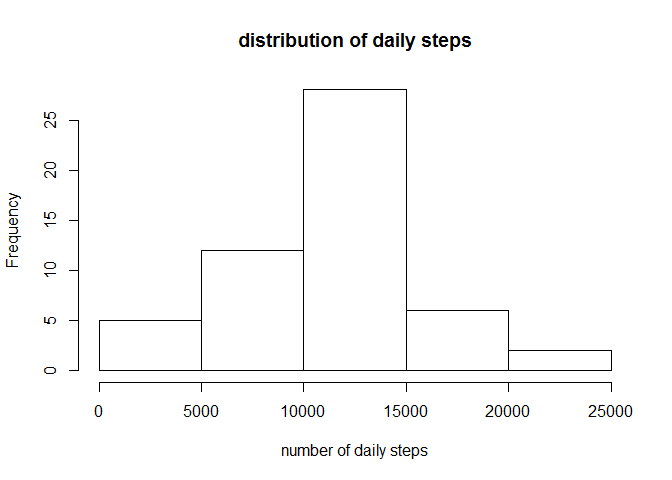
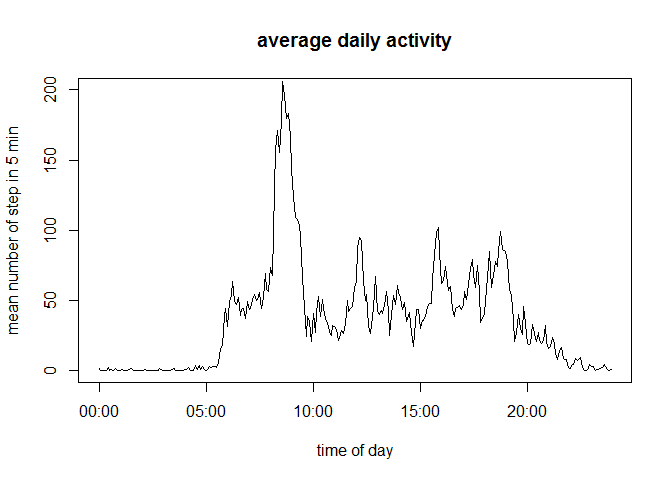
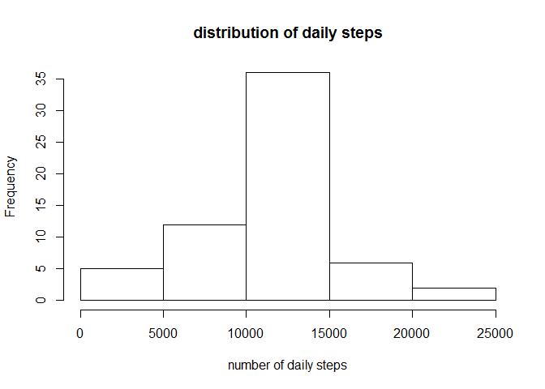
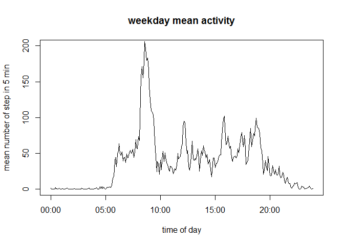
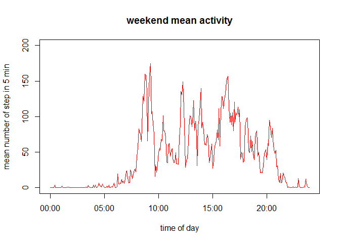

# Reproducible Research: Peer Assessment 1

```
## Warning: package 'lubridate' was built under R version 3.1.2
```

## Executive summary 

This current report is the analysis of activity data recorded on a sensor for a person over a couple of month.

## Data exploration and data cleaning

The dataset used for this analysis is taken from the file: 

https://d396qusza40orc.cloudfront.net/repdata%2Fdata%2Factivity.zip

The variables included in this dataset are:

- steps: Number of steps taking in a 5-minute interval (missing values are coded as NA)
- date: The date on which the measurement was taken in YYYY-MM-DD format
- interval: Identifier for the 5-minute interval in which measurement was taken


```r
activity <- read.csv("C:\\Sandbox\\coursera\\Reprod_Research\\project1\\activity.csv", na.string = "NA")
summary(activity)
```

```
##      steps                date          interval     
##  Min.   :  0.00   2012-10-01:  288   Min.   :   0.0  
##  1st Qu.:  0.00   2012-10-02:  288   1st Qu.: 588.8  
##  Median :  0.00   2012-10-03:  288   Median :1177.5  
##  Mean   : 37.38   2012-10-04:  288   Mean   :1177.5  
##  3rd Qu.: 12.00   2012-10-05:  288   3rd Qu.:1766.2  
##  Max.   :806.00   2012-10-06:  288   Max.   :2355.0  
##  NA's   :2304     (Other)   :15840
```

The first step is to clean the data. the interval variable is a text parameter and should be converted into real time.


```r
#data preparation - reformating time interval to fixed 4 digit 
activity$timeofday <- str_pad(activity$interval, 4, side = "left", pad = "0")
# combining date and time.
activity$timestr <- paste(activity$date, activity$timeofday)

#converting into a datetime POSIXct format. 
activity$timestamp <- strptime(activity$timestr,"%Y-%m-%d %H%M")
```

The summary show a significant number of interval without any information (NA). These lines will be removed.The new data set saved as a data frame is called activity_clean.


```r
index <- !is.na(activity$steps)
activity_clean <-activity[index,]
activity_clean <- as.data.frame(activity[index,])
```

# Analysis of the daily activity

The initial analysis is to look at the total number of steps completed for everyday.


```r
#plot(activity$steps ~ activity$date)
daily_sum_step <- tapply(activity_clean$steps,activity_clean$date, sum)
hist(daily_sum_step,xlab = "number of daily steps", main = "distribution of daily steps")
```

 

the key statistics of this distribution is give below:


```r
d <- summary(daily_sum_step)
print(d)
```

```
##    Min. 1st Qu.  Median    Mean 3rd Qu.    Max.    NA's 
##      41    8841   10760   10770   13290   21190       8
```
The mean and the median number of steps are 10770 and 10760. 

# Average daily pattern

The next step is to analyze the daily pattern of activity.  The day is divided in 5 minute interval. 


```r
#data preparation

timestr <- levels(factor(activity_clean$timeofday))
time <- strptime(timestr, format="%H%M")
time <- data.frame(time)
daily_activity <- ddply(activity_clean, .(timeofday), summarize, mean = mean(steps))

plot(time, daily_activity$mean, type = 'l', xlab = "time of day",ylab = "mean number of step in 5 min",main = "average daily activity",ylim = c(0,200))
```

```
## Warning in if (cl %in% c("integer", "numeric")) stripchart(x1, ...) else
## plot(x1, : the condition has length > 1 and only the first element will be
## used
```

 


```r
mx <- max(daily_activity$mean)
day_max <- daily_activity[daily_activity$mean == mx,]
day_max
```

```
##     timeofday     mean
## 104      0835 206.1698
```

The maximum number of step is 206.1698113 and is occuring at 0835

# Impact of missing values


```r
sum(is.na(activity$steps))
```

```
## [1] 2304
```

The total number of NA in the step dataset is given by 2304

A quick analysis of the location of the NA shows that fews days have 288 NAs. So the strategy is to use the mean values from the other days to complete these missing values.


```r
index_na <- is.na(activity$steps)
activity_na <- activity[index_na,]
missing_timeofday <- activity_na$timeofday
new_table <- join(activity_na,daily_activity, by ="timeofday")
new_table$steps <- new_table$mean
activity_updated <- rbind(activity_clean[,1:6],new_table[,1:6])
```

The table activity_updated is resulting from the merging of the clean data and the data complemented by the mean activity.


```r
#plot(activity$steps ~ activity$date)
daily_sum_update <- tapply(activity_updated$steps,activity_updated$date, sum)
hist(daily_sum_update, xlab = "number of daily steps", main = "distribution of daily steps")
```

 

the key statistics of this distribution is give below:


```r
du <- summary(daily_sum_update)
print(du)
```

```
##    Min. 1st Qu.  Median    Mean 3rd Qu.    Max. 
##      41    9819   10770   10770   12810   21190
```
The mean and the median number of steps are 10770 and 10770. 

These values are very close to the values of the first set. This is expected since we used a mean value for filling the missing information.


# Comparison between week days and week-end days.

We would like to compare activity between week day and week-end days. For this, the data is split into 2 subsets. one subset for week days and one subset for week-end days.


```r
# integrated parameters
activity$dayofweek <- factor(weekdays(activity$timestamp))
activity_clean$dayofweek <- factor(weekdays(activity_clean$timestamp))
#weekend subset
index_weekend <- (activity_clean$dayofweek %in% c("Sunday", "Saturday"))
subset_data_weekend <- ddply(activity_clean[index_weekend,], .(timeofday), summarize, mean = mean(steps))

#week subset
subset_data_week <- ddply(activity_clean[-index_weekend,], .(timeofday), summarize, mean = mean(steps))
```

The following plots are the daily activity for week days and week-end days.

```r
plot(time, subset_data_week$mean, type = 'l', xlab = "time of day",ylab = "mean number of step in 5 min",main = "weekday mean activity",ylim = c(0,200))
```

```
## Warning in if (cl %in% c("integer", "numeric")) stripchart(x1, ...) else
## plot(x1, : the condition has length > 1 and only the first element will be
## used
```

 

```r
plot(time, subset_data_weekend$mean, type = 'l',col = "red", xlab = "time of day",ylab = "mean number of step in 5 min",main = "weekend mean activity",ylim = c(0,200))
```

```
## Warning in if (cl %in% c("integer", "numeric")) stripchart(x1, ...) else
## plot(x1, : the condition has length > 1 and only the first element will be
## used
```

 


